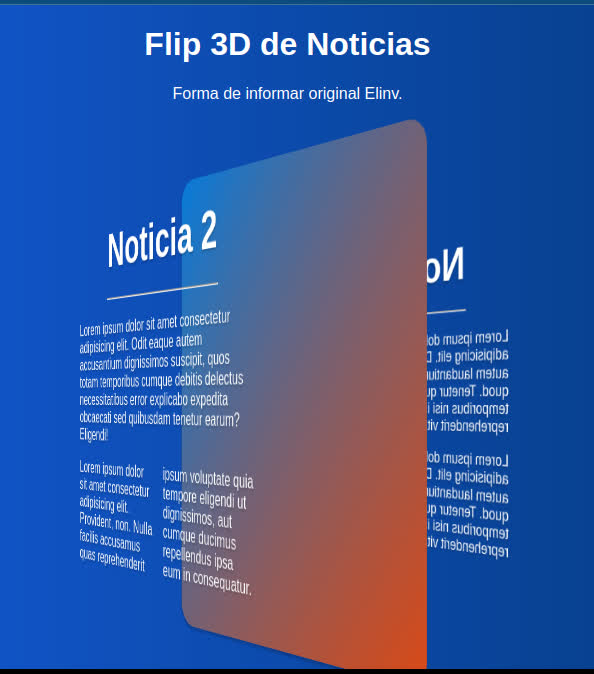

<p align="center">
  <a href="" rel="noopener">
 </a>
</p>

<h3 align="center">Flip de Noticias 3D elinv</h3>

---

## 🧐 Autor:Elinv <a name = "Autor:Elinv"></a>
- [Elinv](https://www.elinv.musica.ar/) - Ideas! solo eso!

El propósito de este proyecto es presentar formas interesantes de salir del status quo en materia de crear formas nuevas.

## 🏁 Como funciona <a name = "Como funciona"></a>

Algo de CSS, muy poco de JS y mas de la mitad de HTML, donde se encuentra los template, en el cual hay que cargar las notas que uno crea conveniente, titularlas, se puede agregar imagenes videos, enlaces, etc... y listo.

### Requisitos

Ninguno, solo hacer click en cualquier parte de la noticia, y cambiará a la siguiente, e incluso cambiará si se hace click en algun enlace de dicha noticias.

```
Solo accione su mouse y vea el efecto hipnótico que tiene esta forma 3D de ver notas, informes, imagenes, etc...
```

## ⛏️ Ejemplo en funcionamiento <a name = "Ver el ejemplo en funcionamiento en nuestra web"></a>

- [Flip de noticias Elinv](https://www.elinv.musica.ar/soft/github/flipDeNoticias/) - Web Elinv

## 🎉 Agradecimientos <a name = "Agradecimientos"></a>

- A Dios!
